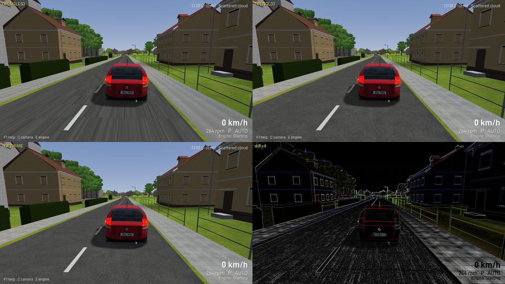
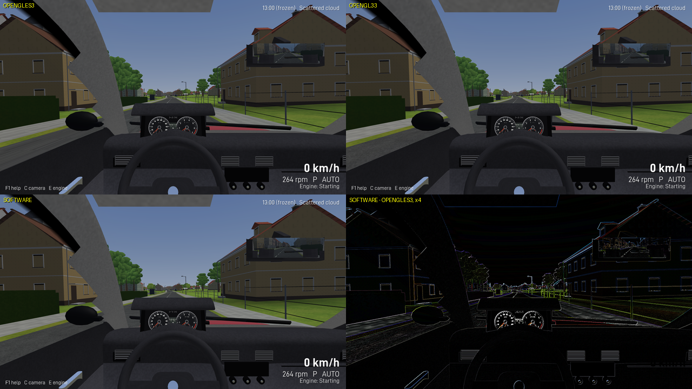

# Renderer conformance

The simulator talks only to the XNA 4.0-compatible public API of CNA (`docs/api-boundary.md`,
enforced by `scripts/check_xna_only.py`), so the same binary source builds against every CNA
renderer. This page records the renderers that were built and run in the development
container and what differed between them. There is no renderer-specific code in the project;
the renderer is chosen with CNA's `CNA_GRAPHICS_RENDERER` cache variable through the CMake
presets (`opengles3`, `opengl33`, `software`, `vulkan`, `default`).

Phase 13 environment (historical results below): Linux container, Xvfb 1280 x 720, Mesa llvmpipe (software OpenGL, 4 threads),
no GPU, no audio device (`SDL_AUDIODRIVER=dummy`), CNA `next` with `easy-gl` and `meta-gl`
checked out beside it.

## Builds

| Preset | `CNA_GRAPHICS_RENDERER` | Build | Notes |
| --- | --- | --- | --- |
| `opengles3` | `OPENGLES3` | ok | CNA's Linux default; the build used for all tests, screenshots and benchmarks. |
| `opengl33` | `OPENGL33` | ok | Desktop OpenGL 3.3 core through EasyGL; Mesa exposes GL 4.5 on llvmpipe. |
| `software` | `SOFTWARE` | ok | CNA's CPU rasteriser; no GL context is created (the window is still an SDL window). |
| `vulkan` | `VULKAN` | not built | No Vulkan ICD in the container (no `lavapipe` package); nothing to run it on. |

Every build is configured with `CNA_CNAEXT=OFF` and the same project options; only the
renderer variable differs. `ctest` runs against the `opengles3` build (196 tests in six registrations).

## Runs

Both scenes use `--no-save --no-audio --lockstep --spawn square --auto-drive 3
--traffic-warmup 20 --time 13:00 --time-scale 0 --weather cloudy --benchmark` so the simulated
state, the clock and the weather are identical on every renderer; the capture is the last frame
(frame 40 exterior, frame 36 cockpit). Times are CPU draw submission
per frame (llvmpipe rasterises on the CPU, so for the GL renderers this includes most of the
rasterisation; the SOFTWARE renderer rasterises inside the draw calls).

| Scene | Renderer | draw calls | triangles | draw submission | world | traffic | vehicle | mirror |
| --- | --- | --- | --- | --- | --- | --- | --- | --- |
| Town, chase camera | OPENGLES3 | 1253 | 1242k | 166 ms | 105 | 53 | 5 | - |
| Town, chase camera | OPENGL33 | 1253 | 1242k | 184 ms | 119 | 57 | 6 | - |
| Town, chase camera | SOFTWARE | 1253 | 1242k | 3599 ms | 2510 | 502 | 207 | - |
| Town, cockpit + mirror + cluster | OPENGLES3 | 1299 | 1245k | 223 ms | 117 | 61 | 5 | 39 |
| Town, cockpit + mirror + cluster | OPENGL33 | 1299 | 1245k | 235 ms | 118 | 69 | 6 | 40 |
| Town, cockpit + mirror + cluster | SOFTWARE | 1299 | 1245k | 4639 ms | 2378 | 536 | 705 | 644 |

Re-measured for Phase 13 with `scripts/renderer_compare.sh`, which prints the table above and
records what was actually done per renderer (see "What 'tested' means here" below).

Draw calls and triangle counts are identical across renderers for the same frame, which is the
expected result of renderer-independent culling. The SOFTWARE renderer is about twenty times
slower than llvmpipe on this scene (single-threaded rasterisation, per-pixel lighting of 1.24 M
triangles) and is only useful for conformance checks and for machines without any GL driver.

These numbers were re-measured on the Phase 12 map (6.4 x 7.6 km, five settlements); the Phase
11 set on the smaller map read 606 draw calls and 575k triangles for the same camera, at 121 ms
on OPENGLES3. OPENGL33 used to be a third faster than OPENGLES3 here and is now level with it:
the frame is dominated by the world and traffic passes, which do the same work on both.

## Image differences

Pixel comparison of the same frame (max channel difference per pixel, 1280 x 720), re-measured
for Phase 13 with `scripts/renderer_sheet.py`, which also builds the sheets below:

| Pair | mean difference | pixels differing by > 32 | > 96 |
| --- | --- | --- | --- |
| OPENGL33 vs OPENGLES3, town | 3.82 / 255 | 0.36 % | 0.000 % |
| SOFTWARE vs OPENGLES3, town | 5.49 / 255 | 1.70 % | 0.083 % |
| OPENGL33 vs OPENGLES3, cockpit | 0.45 / 255 | 0.00 % | 0.000 % |
| SOFTWARE vs OPENGLES3, cockpit | 2.32 / 255 | 1.04 % | 0.105 % |

Unchanged in character from Phase 12 to within a hundredth of a level, which is the point: the
visual work of Phase 13 -- the paint's sun glint, the convex wing mirrors, the headlamp beam, the
wet-road sheen, the softened stars, the tapered forest edges -- introduced **no** renderer-specific
divergence. Every one of them is ordinary XNA 4.0 surface (`EnvironmentMapEffect`, `BasicEffect`
fog, vertex colours, additive blending) and all three renderers agree about it.
| OPENGL33 vs OPENGLES3, instrument cluster target | 0.0 | 0 % | 0 % |
| SOFTWARE vs OPENGLES3, instrument cluster target | 0.07 / 255 | 0 % | 0 % |

What differs, from the comparison images (top left OPENGLES3, top right OPENGL33, bottom
left SOFTWARE, bottom right the SOFTWARE minus OPENGLES3 difference amplified four times):

- **Texture filtering at grazing angles.** On llvmpipe the `OPENGLES3` path shows streaks
  along the road where the asphalt wear tracks and aggregate alias in the distance; `OPENGL33`
  and `SOFTWARE` filter the same mip chain (generated on the CPU by `Image::UploadTexture`)
  smoothly. All three use `SamplerState::AnisotropicWrap`; the difference is the driver's
  anisotropic implementation, not project code. On a GPU with real anisotropic filtering the
  tracks are expected to stay sharp without streaks (see `docs/real-hardware-validation.md`).
- **Edges and thin geometry.** The difference images are dominated by one-pixel edge shifts
  (building silhouettes, window frames, the fence wire, tree card cut-outs): rasterisation
  rules and the alpha-test coverage differ by half a texel. No geometry is missing on any
  renderer.
- **Hedge and lit vertex colours.** The clipped hedge and the road vertex colours are a few
  levels brighter on `SOFTWARE` (its per-pixel lighting interpolates slightly differently);
  the sky gradient, fog, glass reflections, the vehicle ground shadow and the baked ground
  shadows match.
- **Render targets.** The instrument cluster (SpriteBatch into a 1024 x 448 target) is
  bit-identical between the GL renderers and within 0.07 levels on `SOFTWARE`; the mirror
  target (768 x 200, mirrored projection) matches on all three.
- **Text.** HUD and overlay text (premultiplied bitmap font) is identical.

Nothing in the runs required a renderer-specific branch or setting. The one known
renderer-dependent behaviour found during Phase 11, stencil buffer clears not being applied
after the second frame on the EasyGL path, was removed from the design rather than worked
around: the vehicle shadow is a stencil-free convex-hull blob and no code path relies on
stencil state.

## What "tested" means here (Phase 13)

"Three renderers were tested" has to mean something, so each renderer is recorded against the
same six words, and nothing is claimed that was not done. `scripts/renderer_compare.sh` performs
the first four automatically and prints this table; the last two are human steps and the script
says so rather than pretending otherwise.

| | configures | compiles | starts | renders | visually inspected | performance tested |
| --- | --- | --- | --- | --- | --- | --- |
| `OPENGLES3` | yes | yes | yes | yes | yes -- every screenshot in this repository | yes |
| `OPENGL33` | yes | yes | yes | yes | yes -- the two comparison sheets below | yes |
| `SOFTWARE` | yes | yes | yes | yes | yes -- the two comparison sheets below | yes (twenty times slower) |
| `VULKAN` | no | no | no | no | no | no |
| `DIRECTX*`, `METAL`, `WEBGL*` | no | no | no | no | no | no |

- **configures / compiles**: `cmake --preset 
` succeeds and produces a binary.
- **starts**: the process runs the scene and exits cleanly.
- **renders**: a screenshot came out, with its own draw-call and triangle counts.
- **visually inspected**: a person compared the images. **Equal draw calls are not visual
  equivalence** -- the two GL paths submit identical geometry and still differ by 3.8/255 in the
  mean, mostly from anisotropic filtering and half-texel edge coverage, which is exactly why the
  image-difference table below exists and why this row is not inferred from the one above it.
- **performance tested**: the benchmark numbers in this page's tables.

Everything above is the container: Xvfb, Mesa llvmpipe, **no GPU**. On a real machine the whole
table should be re-run (`docs/real-hardware-validation.md`, section 7) and the differences
recorded rather than assumed to vanish; a renderer discrepancy that turns out to be in CNA is to
be isolated and documented there, never worked around with renderer-specific application code.

## Not covered

- `VULKAN`, `DIRECTX*`, `METAL`, `WEBGL*`: not available in the container. The project does
  not use any API outside the XNA 4.0 surface, so no source change is expected; the same three
  scenes should be captured and compared on a machine that has them
  (`docs/real-hardware-validation.md`, section 3).
- Multisampling: `PreferMultiSampling` is left at CNA's default; the captures above are not
  multisampled.

## Phase 14: Radeon 780M desktop conformance

The Phase 13 section above describes the old Xvfb container. This Phase 14 run used the
actual Debian 13 desktop (`DISPLAY=:0`), AMD Radeon 780M, Mesa 25.0.7, `radeonsi` for
OpenGL ES and RADV PHOENIX for Vulkan, 1280 × 720. Vulkan now configures, compiles, starts
and renders on this machine. `vulkaninfo --summary` and the CNA startup log both identify
the Radeon 780M; the run used `MESA_VK_DEVICE_SELECT=1002:15bf`. No project code selected a
renderer or accessed its internals.

The fixed town scene used `--no-save --no-audio --lockstep --spawn square --frames 40
--traffic-warmup 20 --time 13:00 --time-scale 0 --weather cloudy --view -78 9 -30 50 -6
--benchmark --screenshot` on both builds at the same source commit (`f61e7ed`). The
benchmark excludes 30 warmup frames and measures 10 frames. Both report 1215 project draw
submissions, 1,450,306 triangles, 203 visible terrain chunks, 84 road batches, 370 object
batches, 40 tree batches, 20 traffic cars (four drawn), and 36 pedestrians (four drawn).
Project draw submission averaged 9.46 ms on OPENGLES3 and 7.59 ms on Vulkan. These are
short conformance captures, not a renderer speed ranking: the desktop throttled this
unfocused window to about 1.1 seconds of wall time per frame.

The corresponding cockpit and 1024 × 448 live instrument-cluster targets were also captured
on both renderers from the same two-frame startup state. Manual side-by-side inspection found
the same world objects, glass, mirror, wheel, controls, gauge labels and lamps. The images
are close, not pixel-identical; edge coverage, filtering and antialiasing differ. Pixel
comparison uses maximum absolute RGB channel difference per pixel:

| OPENGLES3 vs Vulkan | Mean absolute RGB difference (R/G/B, of 255) | Pixels > 32 | Pixels > 96 |
| --- | --- | --- | --- |
| Town fixed camera | 0.716 / 0.683 / 0.680 | 0.65% | 0.196% |
| Cockpit startup | 0.899 / 0.873 / 0.819 | 0.687% | 0.252% |
| Instrument cluster target | 1.292 / 1.258 / 1.201 | 1.422% | 0.320% |

The current OPENGL33 build, running on the same Radeon through desktop OpenGL 4.6, reported
the same 1215 submissions and 1,450,306 triangles in the fixed town scene. Its town,
cockpit and cluster PNGs are byte-identical to OPENGLES3 (SHA-256 comparisons). Its 10-frame
project draw submission average was 11.73 ms under the same unfocused-window throttling;
that number cannot establish a performance ranking.

The SOFTWARE renderer also built and completed the same 40-frame town scene offscreen with
1215 submissions and 1,450,306 triangles. Its project draw submission averaged 3802.73 ms
per measured frame; this CPU rasterisation result is not a Radeon GPU timing. Compared with
OPENGLES3, mean absolute RGB difference was 3.978 / 4.031 / 3.975 levels of 255, with
0.968% of pixels differing by more than 32 and 0.049% by more than 96 in any channel.
The [paired town capture](screenshots/renderers/phase14-gles-software-town.jpg) (OPENGLES3
left, SOFTWARE right) shows the same geometry, surface colours and scene content. Differences
are mainly filtering and edge coverage. The startup cockpit and cluster targets were also
captured and visually inspected. The [cockpit pair](screenshots/renderers/phase14-gles-software-cockpit.jpg)
has the same mirror, road, controls and gauges; its mean RGB difference is 1.863 / 2.026 /
1.623 levels, with 1.925% of pixels over 32 and 0.068% over 96. The
[cluster pair](screenshots/renderers/phase14-gles-software-cluster.png) differs by just
0.006 / 0.005 / 0.006 mean levels, with no pixel over 32. Small differences are visible on
green terrain and edges, but no content is absent.

The three paired captures show OPENGLES3 on the left and Vulkan on the right:
[town](screenshots/renderers/phase14-gles-vulkan-town.jpg),
[cockpit](screenshots/renderers/phase14-gles-vulkan-cockpit.jpg), and
[cluster](screenshots/renderers/phase14-gles-vulkan-cluster.png).

There is no missing pass or renderer-specific application fix. The matched geometry and
inspected images matter more for conformance than matched draw counts alone. The historical
tables above remain labelled as Phase 13 results.

### Phase 14 tree atlas checkpoint (2026-09-25)

After adding two seeded silhouettes per tree species in one XNA texture atlas, all four
available renderers built and captured the same two-frame forest view at 1280 × 720:
`--no-save --no-audio --lockstep --spawn forest --frames 2 --time 13:00 --time-scale 0
--weather clear --view -228 5 -1280 0 -4`. OPENGLES3, OPENGL33 and Vulkan RADV used the
Radeon 780M desktop; SOFTWARE used CNA's offscreen CPU path. No project renderer branch or
renderer-native API was added. The four retained captures are
[OPENGLES3](screenshots/renderers/phase14-forest-gles3.png),
[OPENGL33](screenshots/renderers/phase14-forest-gl33.png),
[Vulkan](screenshots/renderers/phase14-forest-vulkan.png) and
[SOFTWARE](screenshots/renderers/phase14-forest-software.png).

The OPENGL33 frame is byte-identical to OPENGLES3. Visual inspection found the same crown
variants, trunk positions and alpha edges on Vulkan and SOFTWARE, without atlas seams or
missing vegetation. Against OPENGLES3, mean absolute RGB difference was
0.545 / 0.490 / 0.594 on Vulkan (0.694% of pixels differ by >32 in any channel) and
2.528 / 2.371 / 1.222 on SOFTWARE (0.442% >32). The Vulkan and SOFTWARE differences are
concentrated around foliage edges, filtering and ground texture; no renderer-specific
project fix was needed. These are conformance frames, not performance comparisons.

### Phase 14 cockpit trim checkpoint (2026-09-25)

After the centre radio gained a moulded surround and physical controls, the cockpit was
captured at 13:00, clear weather, square spawn, frame 3, 1280 × 720 on all four supported
renderers. All binaries include the subsequent byte-identical car geometry helper extraction.
The retained frames are [OPENGLES3](screenshots/renderers/phase14-console-gles3.jpg),
[OPENGL33](screenshots/renderers/phase14-console-gl33.jpg),
[Vulkan](screenshots/renderers/phase14-console-vulkan.jpg) and
[SOFTWARE](screenshots/renderers/phase14-console-software.jpg).

The controls, cluster, mirrors and road appear in all four. OPENGL33 differs from OPENGLES3
by at most one RGB level; the mean absolute RGB differences are 0.864 / 0.826 / 0.788 for
Vulkan and 1.966 / 2.110 / 1.703 for SOFTWARE. The differences are in shading and edge
coverage; no content is missing and no renderer-specific project code was added.

### Phase 14 local solid-line checkpoint (2026-09-25)

The newly authored solid centre-line section on `main` near E3 was captured at 13:00,
clear weather, frame 2, 1280 × 720, from `--view 1300 15 -330 40 -8` on OPENGLES3,
OPENGL33, Vulkan and SOFTWARE. The [before](screenshots/phase14/centre-section-before.jpg)
and [after](screenshots/phase14/centre-section-after.jpg) Radeon OPENGLES3 frames show
the dashed line changing to a continuous line on the same road geometry.

All four renderers show the same continuous stroke and road scene. OPENGL33 is byte-identical
to OPENGLES3. Mean absolute RGB differences against OPENGLES3 were 0.608 / 0.594 / 0.660
for Vulkan and 2.797 / 2.450 / 1.186 for SOFTWARE, mainly from foliage and ground
filtering. No renderer-specific application code was added.

### Phase 14 B 21 roadside sign checkpoint (2026-09-25)

After adding procedural B 21a/B 21b faces and plates at the E3 restriction, all four
renderers captured the same 1280 × 720 clear 13:00 view at frame 2 with
`--view 1160 8 -273 68 -7`. The retained
[Radeon OPENGLES3 view](screenshots/phase14/overtaking-sign.jpg) shows the B 21a plate
beside the authored restriction. OPENGL33 was byte-identical. Mean absolute RGB difference
against OPENGLES3 was 0.719 / 0.702 / 0.726 for Vulkan RADV and
7.766 / 7.745 / 4.515 for SOFTWARE. Visual inspection found the same plate and road
marking in all four; the larger software difference is mainly surface and vegetation tone.
